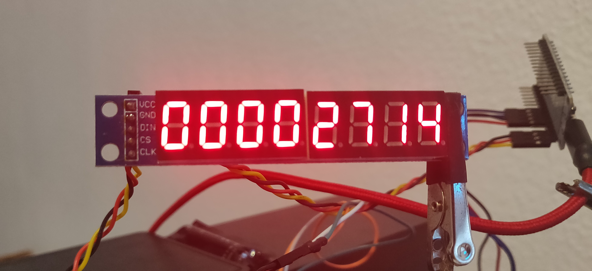

# coronaTicker

Displays the number of currently infected patients in Germany.
Easily adaptable to other countries.
Takes the information from https://www.worldometers.info/coronavirus/country/germany/ and parses for the number.

## Hardware 
* Nodemcu
* MAX7219 7-Segment Display

